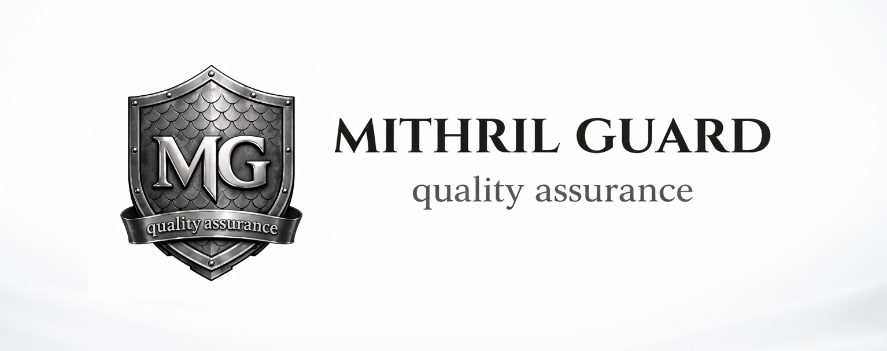
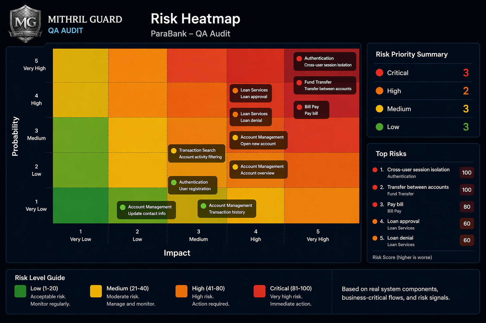

### Risk-driven QA for SaaS teams that ship fast.

 

  <i>We help SaaS teams reduce production risk and gain release confidence</i> 
  <i>by turning QA into a structured, risk-driven system.</i>

 

&nbsp;

  

 

<!--  -->

---

## 📊 Risk-driven system in practice

 

 

**QA Audit snapshot** — based on real system components, business-critical flows, and risk signals.

---

## 🔹 What we do

We build **risk-driven QA systems** that help teams understand where their product can break — and what it will cost when it does.

Instead of testing everything blindly, we focus on:

- 🎯 **Identifying** the most failure-prone areas of the system
- 💰 **Quantifying** business impact of potential failures
- ⚡ **Prioritizing** testing and automation where it matters most

> Automation becomes the **execution layer** of the strategy,
> while manual testing provides **direction, exploration, and judgment**.

This creates a clear, risk-driven foundation for confident releases.

---

## 🔹 The problem

SaaS products evolve faster than the systems that are meant to protect them.

Features are shipped under pressure.
Multiple teams change different parts of the product.

No one has a clear view of:

- what is **risky**
- what is **safe**
- what is likely to **break next**

The result is predictable:

| 🔻 Regressions in critical flows | 🔻 Production incidents |
| :------------------------------- | :---------------------- |
| 🔻 **Customer frustration**      | 🔻 **Revenue loss**     |

Teams are not missing tests.
They are missing **risk visibility and release control**.

> They ship **hoping** nothing breaks —
> instead of **knowing** what will.

---

## 🔹 How it works

Every feature, change, and release is evaluated through the lens of **risk**.

Instead of treating all parts of the system equally, we focus on:

- where failures are **most likely to occur**
- where failures would have the **highest business impact**

This creates a clear structure:

- 🔴 **High-risk areas** receive deeper validation and stronger protection
- 🟢 **Low-risk areas** move faster without unnecessary friction

QA becomes part of the full product lifecycle:

`requirements` → `design` → `development` → `release` → `real user feedback`

Each cycle improves:

- ✅ system stability
- ✅ release predictability
- ✅ long-term maintainability

---

## 🔹 Engagement models

<table>
<tr>
<td width="33%" valign="top">

### 🔍 QA Audit

A focused assessment designed to identify where your system is most at risk.

- rapid discovery of failure-prone areas
- evaluation of business impact
- clear, actionable insights

**Best for:** teams that need immediate clarity and direction.

 

</td>
<td width="33%" valign="top">

### 🏗️ Test Foundation

A structured QA system built around your real product behavior and risk profile.

- risk-based test strategy
- coverage aligned with critical business flows
- automation-ready test design

**Best for:** teams that need a scalable and maintainable QA setup.

</td>
<td width="33%" valign="top">

### 🔄 Continuous QA

Ongoing risk control embedded into your development and release process.

- continuous validation of critical flows
- integration with CI/CD pipelines
- real-time quality visibility

**Best for:** teams that want consistent release confidence.

</td>
</tr>
</table>

 

#### Not sure where to start?

If you're unsure where to start, book a short call and we'll figure it out together.

---

## 🔹 Why teams work with us

We don't treat QA as a testing activity —
we treat it as a **system for controlling risk and protecting business value**.

What this means in practice:

- ✔️ QA is aligned with **business impact**, not just technical validation
- ✔️ Risk is made **visible, measurable, and actionable**
- ✔️ Decisions are **guided**, not just reported
- ✔️ Quality is **owned** across the full product lifecycle

We focus on **clarity, accountability, and real system behavior** —
not just test execution.

> This approach turns QA from a **cost center** into a **decision-making layer**.
> QA is not about more tests — it's about **better decisions**.

---

 

### 🛡️ Mithril Guard QA

**Quality you can trust. Releases you can predict.**

 

&nbsp;

  

© Mithril Guard QA · Built for teams that ship fast without breaking things.

